# MealIQ - Stage 1 Project Design Report

**Course:** EECS3311 Software Design
**Project:** MealIQ - AI Meal Planning and Grocery Optimization Agent
**Stage:** 1 - Software and Agent Design
**Status:** Design package. No application code has been written yet; implementation is planned for Stage 2 and testing for Stage 3.

## Executive summary

MealIQ is a domain-specific AI agent that creates and revises weekly meal plans and grocery lists. It balances, all at once:

- pantry inventory;
- nutrition goals;
- dietary restrictions and allergies;
- disliked and preferred foods;
- meals per day;
- the grocery budget;
- cooking-time limits that change from day to day.

It is an agent, not a chatbot. It interprets natural-language requests, lets the LLM choose which tool to call next in a bounded, validated tool loop, retrieves and ranks recipes, generates recipes and substitutions when needed, plans in several steps, remembers confirmed decisions, and adapts an existing plan when circumstances change.

The design separates two kinds of responsibility:

- **Probabilistic work** belongs to the agent and an external LLM, reached through the provider-neutral `LLMClient`: interpreting requests, choosing tools and options, and proposing changes.
- **Authoritative work** belongs to deterministic code: candidate ranking (the `PlanningStrategy` implementations), arithmetic, validation, state changes, and storage.

Every LLM proposal becomes a structured `PlanningProposal` or `PlanChange`. It is validated deterministically, previewed, and applied through a command only after the user confirms.

This report is the entry point to the Stage 1 package. Each section summarises one deliverable, shows the related diagrams, and links to the detailed document.

## Deliverable map

| Course deliverable (Stage 1 instructions) | Location |
|---|---|
| Project overview: problem, users, agent, AI/LLM model, architecture | [project-overview.md](project-overview.md), section 1 |
| Detailed feature specifications (10 or more features, with input, output, workflow, and AI classification) | [feature-specifications.md](feature-specifications.md), section 2 |
| UML class diagram, with at least five meaningful design patterns | Section 5, [diagrams](diagrams/) |
| Design pattern explanations | [design-patterns.md](design-patterns.md), section 3 |
| Use-case diagram | Section 4 |
| Detailed use-case descriptions | [use-cases.md](use-cases.md) |
| Sequence diagrams | Section 6 |
| Feature-to-design traceability table | [traceability.md](traceability.md), section 7 |
| Feature implementation explanations | [traceability.md](traceability.md#feature-realization) |
| Important design decisions | [design-decisions.md](design-decisions.md), section 8 |

## 1. Project overview

**Problem.** Planning meals becomes a constraint-satisfaction problem when goals, allergies, dislikes, the food already at home, a budget, and uneven cooking time all matter at once. Recipe search alone does not work out shortages, combine a grocery list, explain trade-offs, or safely adapt a plan after something changes.

**Users.** An individual household meal planner. MealIQ is a planning aid, not a medical or clinical nutrition service.

**Why an agent.** A request such as "high protein, $100 this week, I have chicken and rice, no mushrooms, 20 minutes tonight" implies a sequence of decisions:

1. Interpret the constraints.
2. Retrieve candidates with tools.
3. Rank them under competing constraints.
4. Calculate the consequences.
5. Propose a plan and explain it.
6. Revise the plan later.

**AI/LLM model.** MealIQ will call an external LLM API in Stage 2. OpenAI is the initial planned provider: Stage 2 will use an OpenAI GPT model that supports structured (JSON-schema) outputs; the specific model version will be pinned and documented when implementation begins. It is isolated behind `LLMClient` and `ProviderLLMAdapter`, so another provider (for example Anthropic or Gemini) needs only a new adapter.

**Architecture and technology.**

- React + TypeScript GUI, which reaches the backend over HTTP through `MealPlanningApi` (FastAPI).
- Python Typer CLI, which calls the facade in-process.
- `MealPlanningFacade`, the single shared application boundary.
- `AgentController`, `MealPlanningAgent`, tools, memory, and the LLM adapter.
- Deterministic services and validators.
- SQLAlchemy repositories over PostgreSQL.
- Pydantic for request and structured-output validation, and pytest planned for Stage 3.

Details are in [project-overview.md](project-overview.md).

## 2. Features

There are thirteen features, F01-F13: preferences, pantry, recipe search, recipe generation, weekly planning, nutrition, grocery generation, grocery optimization, substitution, natural-language modification, time-aware planning, budget-aware planning, and dynamic adaptation. Each is specified with the fields the Stage 1 instructions require (description, why it is needed, GUI and CLI interaction, input, output, AI involvement, expected workflow, and error and alternative cases) in [feature-specifications.md](feature-specifications.md).

## 3. Design patterns

| Pattern | Problem solved | Main participants |
|---|---|---|
| Strategy | Different ranking policies for different planning modes | `PlanningStrategy`, `NutritionGoalStrategy`, `BudgetStrategy`, `TimeAwareStrategy`, `MealPlanningAgent` |
| Factory Method | Creating the right strategy without coupling the agent to concrete classes | `PlanningStrategyFactory`, `DefaultPlanningStrategyFactory` |
| Command | Previewable, auditable, reversible plan changes | `PlanChangeCommand`, `ReplaceMealCommand`, `SubstituteIngredientCommand`, `UpdatePlanConstraintCommand`, `MealPlanService` (invoker), `MealPlan` (receiver) |
| Observer | Reacting to pantry and profile changes without coupling the services that publish them | `PlanRelevantChangePublisher`, `PantryService`, `ProfileService`, `PlanImpactObserver`, `MealPlanImpactObserver`, `GroceryListImpactObserver` |
| Facade | One application boundary shared by the GUI and the CLI | `MealPlanningFacade`, `MealPlanningApi`, `MealPlanningCLI` |
| Adapter | Isolating provider-specific LLM, recipe, and price APIs | `LLMClient` / `ProviderLLMAdapter`, `RecipeDataSource` / `ExternalRecipeAdapter`, `PriceDataSource` / `ExternalPriceAdapter` |

For each pattern, [design-patterns.md](design-patterns.md) gives the problem, participants and roles, rationale, what would be harder without it, and where it appears in the UML.

## 4. Use cases

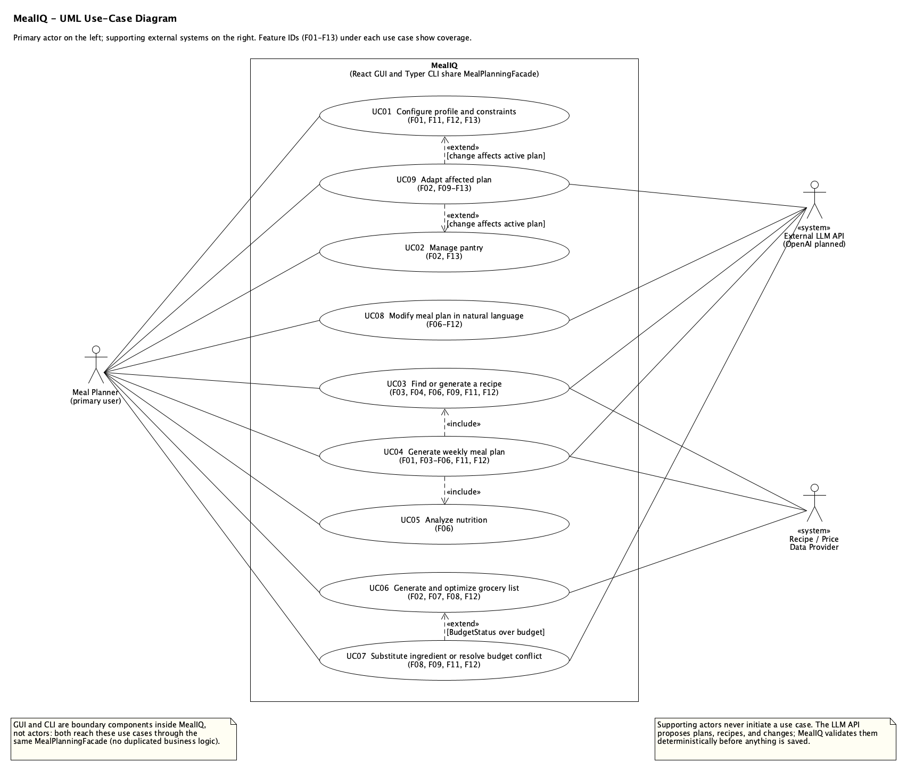

Source: [use-case-diagram.uxf](diagrams/umlet/use-case-diagram.uxf).

- **Actors.** The Meal Planner is the primary actor. The External LLM API and the Recipe / Price Data Provider are supporting «system» actors.
- **Use cases.** There are nine, each labelled with the features it covers.
- **Relationships.** UC04 «include»s UC03 and UC05. UC07 «extend»s UC06 when over budget. UC09 «extend»s UC01 and UC02 when a change affects the active plan.

[use-cases.md](use-cases.md) describes each use case with ID, name, actors, goal, preconditions, trigger, numbered main success scenario, alternative and exception flows, postconditions, and related features.

## 5. Class diagrams

The class model has 81 classes, interfaces, and enumerations in thirteen packages. All views come from the same model, so names, members, and relationships are identical across them.

**Complete class diagram.** Every class with typed attributes, operations, visibility, stereotypes, multiplicities, associations, aggregation and composition, generalization, and realization. Cross-package dependency arrows are left to the focused views to keep it readable.

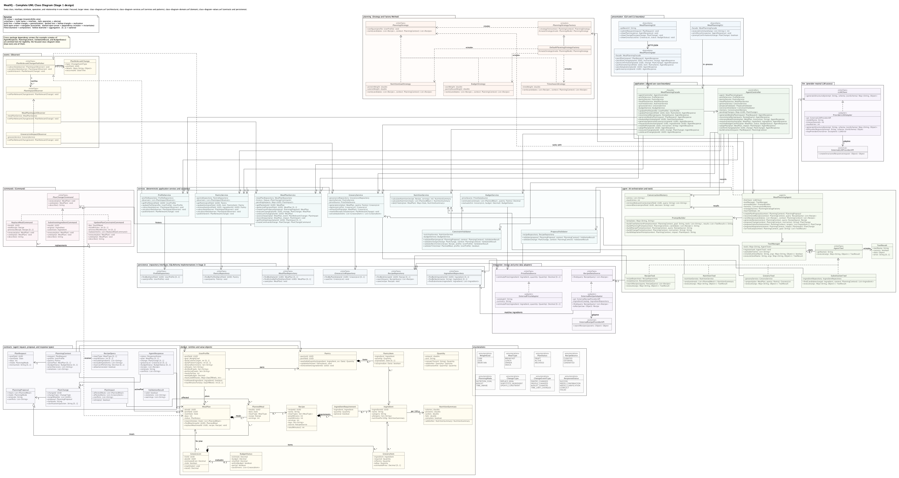

Source: [class-diagram-complete.uxf](diagrams/umlet/class-diagram-complete.uxf).

The four focused views below show the same model at a readable scale. Classes detailed in another view appear as dashed context boxes, and together the focused views draw every relationship, including all dependencies.

**Architecture, agent, and integrations:** GUI, API, CLI, facade, controller, agent, tools, memory, prompt builder, LLM adapter, and recipe and price adapters.

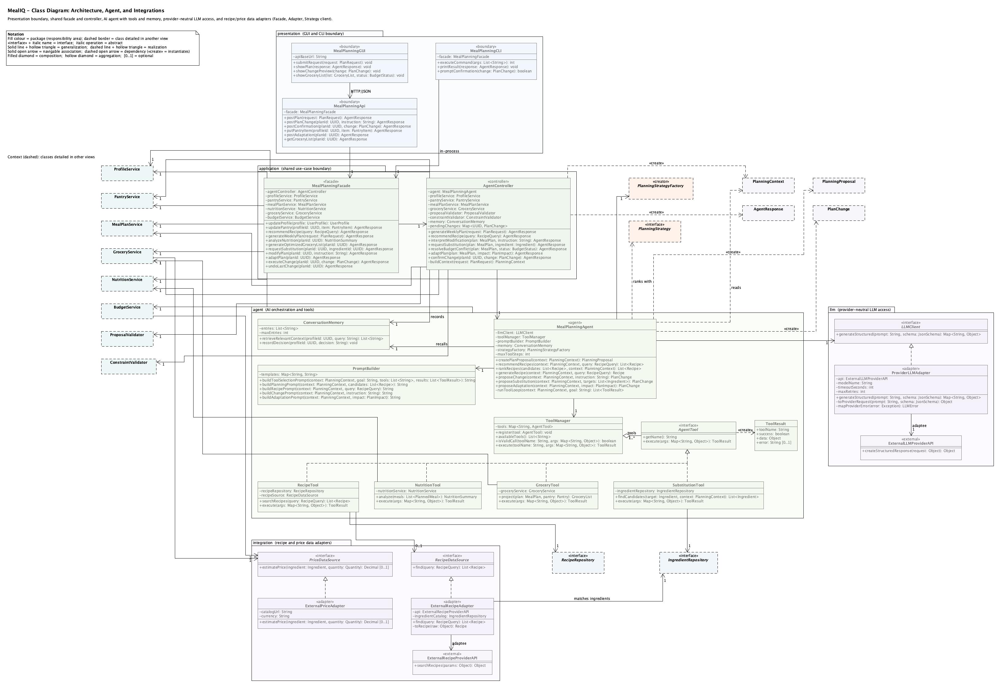

Source: [class-diagram.uxf](diagrams/umlet/class-diagram.uxf).

**Services and design patterns:** deterministic services and validators with the Strategy, Factory Method, Observer, and Command structures.

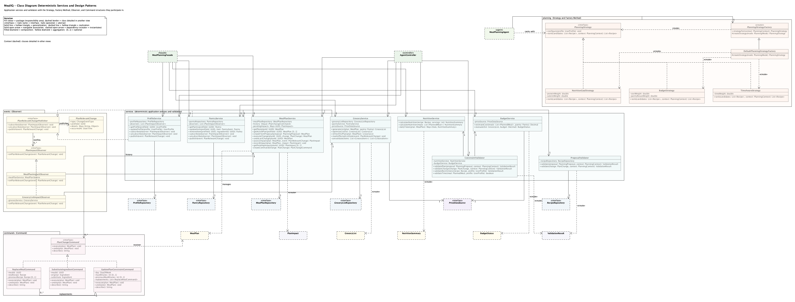

Source: [class-diagram-services.uxf](diagrams/umlet/class-diagram-services.uxf).

**Domain entities and enumerations.**

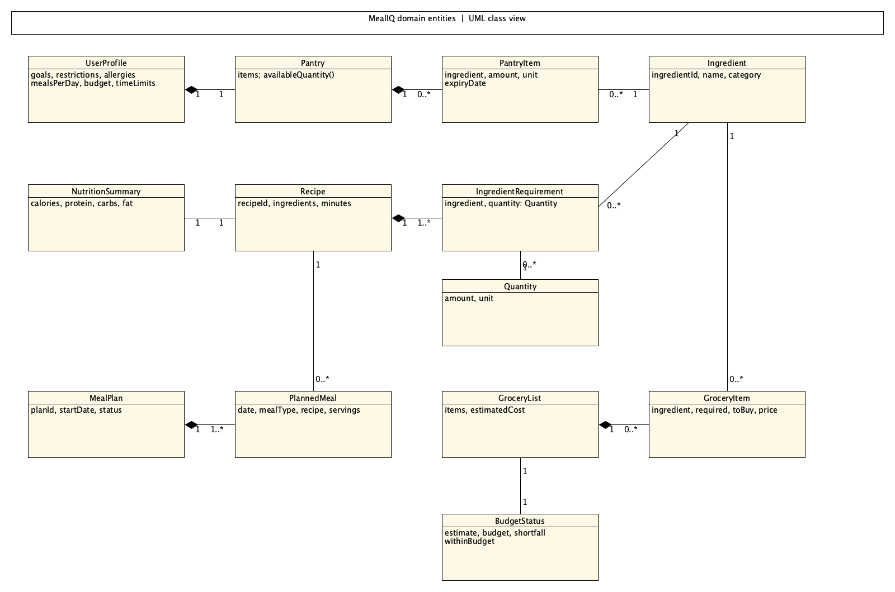

Source: [class-diagram-domain.uxf](diagrams/umlet/class-diagram-domain.uxf).

**Agent contracts and persistence:** request, context, proposal, change, impact, validation, and response types, and the repository interfaces.

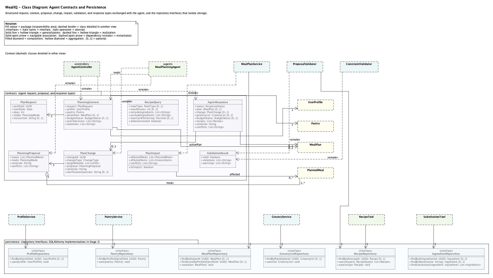

Source: [class-diagram-values.uxf](diagrams/umlet/class-diagram-values.uxf).

## 6. Sequence diagrams

Each diagram shows:

- the initiating actor and the GUI boundary;
- `MealPlanningFacade` and `AgentController`;
- agent components and tools;
- deterministic services, domain objects, and repositories;
- external APIs.

Messages are numbered and returns are shown, with activation bars and `alt` / `opt` / `loop` / `ref` fragments for alternative and error flows. Every call uses an operation defined in the class diagram. SD01 shows the full HTTP path (`MealPlanningGUI` → `MealPlanningApi` → `MealPlanningFacade`); the other diagrams note that path in their titles. The sequence diagrams use wide layouts, with 15-19 lifelines depending on the interaction.

| Diagram | Use case(s) | Features | Main alternative / error flows |
|---|---|---|---|
| SD01 Generate weekly meal plan | UC04 (+ UC03, UC05) | F01, F03-F06, F11, F12 | `loop` re-plan on violations; nested `loop` LLM-driven tool selection with `alt` valid call / custom recipe (`ref` SD05) / invalid call / ready; `alt` save versus `CONFLICT` |
| SD02 Generate and optimize grocery list | UC06, UC07 | F07, F08, F09, F12 | `loop` over requirements and prices; `alt` within budget versus substitution proposal (LLM-driven tool loop) |
| SD03 Modify plan in natural language | UC08 (+ UC07 confirmation) | F06, F07, F09-F12 | `loop` LLM retry; `alt` clarification / failure / valid; `alt` confirm versus cancel |
| SD04 Adapt after pantry or constraint change | UC02, UC09 (UC01 path noted) | F02, F09, F11-F13 | observers only record the impact (no LLM call inside the event); `opt` user chooses to adapt, with tool `loop`; `alt` confirm versus no feasible adaptation |
| SD05 Find or generate recipe | UC03 | F03, F04, F06, F11, F12 | `opt` external provider; `alt` generate versus ranked results; `loop` validation; `alt` success versus conflict |

UC01 and UC05 are single facade-to-service calls with the same boundary structure, so their behaviour is covered by the profile-change path noted in SD04 and the `NutritionService` calls in SD01 and SD05.

**SD01: Generate weekly meal plan.**

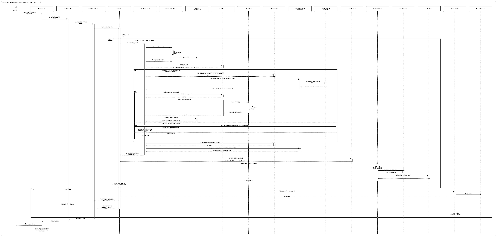

Source: [sequence-meal-plan.uxf](diagrams/umlet/sequence-meal-plan.uxf).

**SD02: Generate and optimize grocery list.**

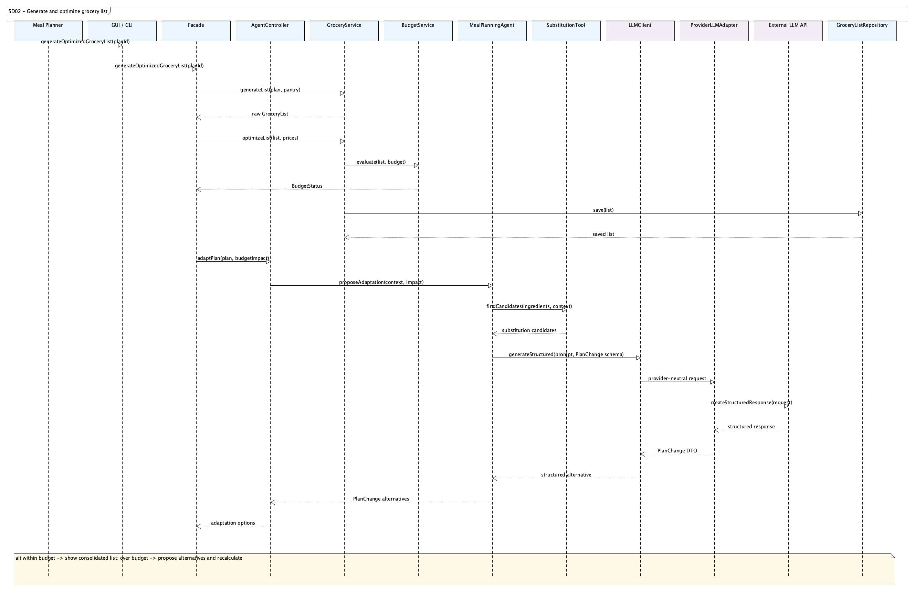

Source: [sequence-grocery.uxf](diagrams/umlet/sequence-grocery.uxf).

**SD03: Modify meal plan using natural language.**

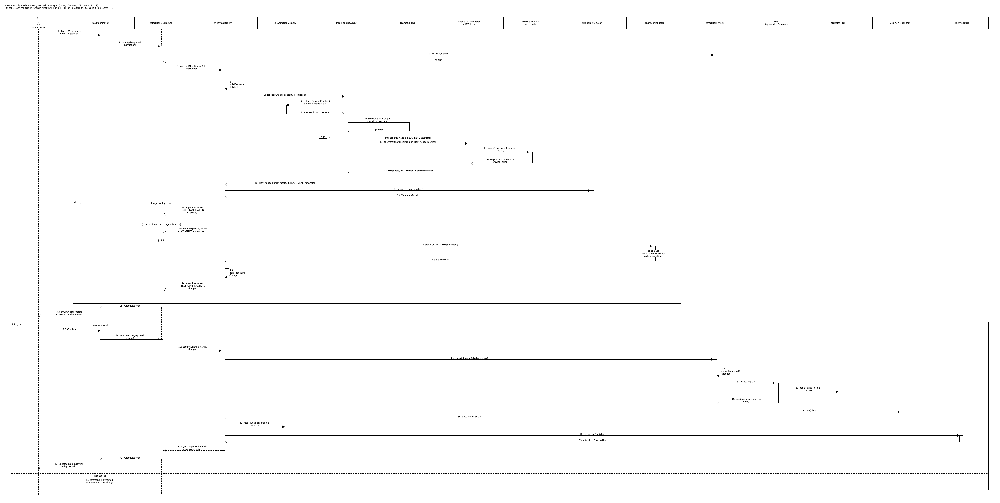

Source: [sequence-modification.uxf](diagrams/umlet/sequence-modification.uxf).

**SD04: Adapt meal plan after a pantry or constraint change.**

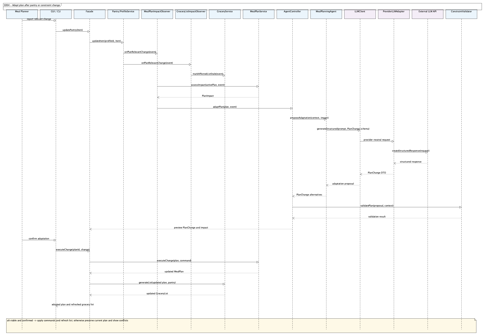

Source: [sequence-adaptation.uxf](diagrams/umlet/sequence-adaptation.uxf).

**SD05: Find or generate recipe.**

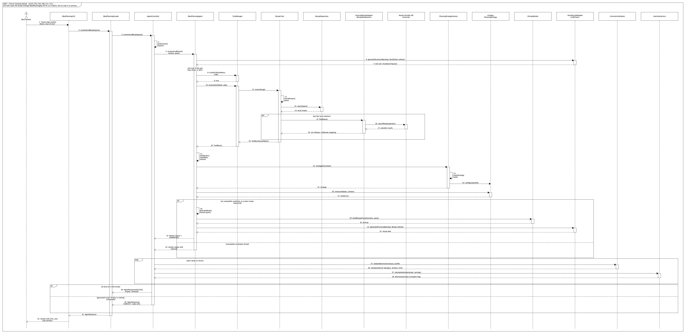

Source: [sequence-recipe.uxf](diagrams/umlet/sequence-recipe.uxf).

## 7. Feature-to-design traceability and realization

[traceability.md](traceability.md) contains the table required by the instructions (feature, description, type, related use case, classes, key methods, sequence diagram, design patterns). For every feature it then gives a realization explaining:

- the related use case and sequence diagram;
- each class involved and its responsibility;
- the important methods;
- how the classes collaborate;
- where AI and deterministic logic occur;
- error handling.

## 8. Design decisions, scope, and testability

[design-decisions.md](design-decisions.md) records the main decisions:

- a hybrid agent with deterministic guardrails;
- LLM-driven tool selection over deterministic tools, bounded and validated;
- a shared facade, with an API boundary for the GUI only;
- structured proposals before any state change;
- a precedence order for constraints;
- provider-neutral integrations;
- the source of nutrition data and the ingredient-matching rules;
- local event-driven impact detection, with no LLM call inside event handling;
- test seams designed in from the start.

It also outlines the Stage 3 plan: pytest for deterministic components and KUMA behavioural tests for the agent. Scope and assumptions are in [project-overview.md](project-overview.md#scope-and-assumptions).

## 9. Consistency checks

These checks were performed on the Stage 1 artifacts.

| Check | Result | Evidence |
|---|---|---|
| At least 10 meaningful features | 13 features, F01-F13 | Feature specifications |
| GUI and CLI provide the major functionality without duplicated logic | Both reach `MealPlanningFacade`; the GUI through `MealPlanningApi` | Architecture class view, SD01 |
| AI/LLM integrated with meaningful agent behaviour | LLM-chosen tool use, planning, generation, memory, adaptation | `MealPlanningAgent`, `ToolManager`, `ConversationMemory`; SD01-SD05 |
| At least five meaningful design patterns | Six | Design patterns, services and patterns view |
| Every feature maps to a use case, classes, methods, a sequence diagram, and patterns | All 13 rows complete | Traceability table |
| Sequence diagram calls exist in the class model | Every call checked against the model's operations | SD01-SD05 |
| Names consistent across documents and diagrams | Every class and method named in the documents exists in the class model | All documents |
| Agent and deterministic responsibilities separated | Every feature states where AI and deterministic logic occur | Feature specifications, traceability |
| Stage boundary respected | Documentation and diagram sources only; no application code | Repository contents |

## Repository scope

The repository contains the Stage 1 design documents, editable UMLet `.uxf` diagram sources, and PNG exports rendered by UMLet from those sources.
